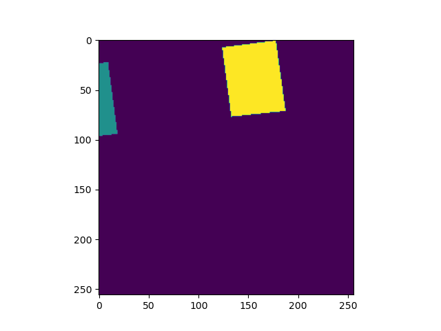
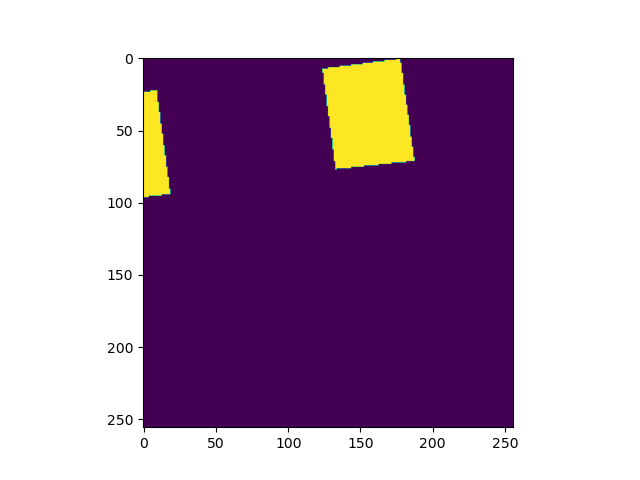

# Reclassify Raster

Little helper function to reclassify rasters for my deep learning Training data. Reclassify all classes other than 0 into 1, so that I end up with patches with only two classes (0 and 1).

## Example

Before:

After:

